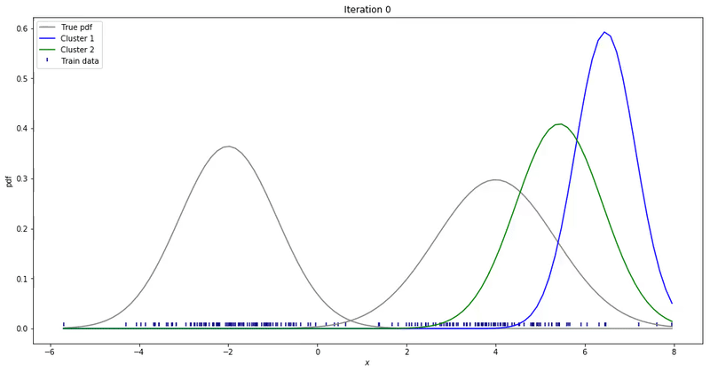

# cdhmm
An easy to use python library consisting implementation of Continuous Density Hidden Markov Models.

Continuous Density Hidden Markov Models(CD-HMM) are a type of HMM which consists of Emission probabilities in the form of a distribution like gaussian or uniform distribution. Despite its use in Speech processing, very less codes are available on the internet regarding CD-HMM. This library has implementation of all HMM algorithms applied on continuous density observations.

After studying Hidden Markov Models(HMM) for a while now, I have came across many python libraries which implements HMM algorithms like forward,  backward, Viterbi and Baum-Welch. However, most of these libraries work on discrete observations. cdhmm library is developed for can be used to do HMM operations on Continuous observations.

## Supported Algorithms

1. #### Forward Algorithm
2. #### Backward Algorithm
3. #### Occupation Likelihood
4. #### Baum Welch Algorithm



## Prerequisites

Install numpy, scipy and seaborn by executing following commands:
```
pip install numpy
pip install scipy
pip install seaborn
```

## Installation

After installing prerequisites, install cdhmm library by executing following command:

```
pip install cdhmm-ashishmokalkar==0.0.2
```

## Project Page

For Official project page, visit following website:

```
https://pypi.org/project/cdhmm-ashishmokalkar/0.0.2/
```

## Tutorial 

##### Import cdhmm library using following code:

```
import cdhmm as cd
```
##### Consider a Continuous density HMM with 2 states and 7 continuous observations.

```
import numpy as np

observations = [1.2, 2.4, 2.9, 3.7, 4.1, 4.8, 6.2]
transition_probs = np.array([[0.68, 0.29], [0.18, 0.91]])
pi = np.array([0.83, 0.24])  #initial probability 
means = [3.00, 5.00]
variances = [1.44, 0.64]
exit_p = [0.07, 0.06]
```

##### Now, building HMM model using these parameters is as simple as executing the following code

```
hmms = cd.simple_cdhmm(obs, means, variances, pi, transition_probs, exit_p)
```

##### Get probability density values at observation points :

```
Em = hmms.get_probability_densities()
print (Em)
```

##### Forward Algorithm:

```
alpha = hmms.forward()
print("Alphas :: ")
print(alpha)
```

##### Forward Likelihood

```
like_f = hmms.likelihood()
print("Forward Likelihood :: ")
print (like_f)
```

##### Backward Algorithm

```
beta = hmms.backward()
print("Beta :: ")
print (beta)
```

##### Backward Likelihood

```
like_b = hmms.likelihood_b()
print("Backward Likelihood :: ")
print (like_b)
```

##### occupation likelihood

```
occ = hmms.get_occupation_likelihoods()
print("Occupation likelihoods :: ")
print (occ)
```

##### Re-estimate Means

```
new_means = hmms.getNewMean()
print("New means :: ")
print (new_means)
```

##### Re-estimate Variances

```
new_vars = hmms.getNewVariance()
print("New Variances :: ")
print (new_vars)
```

### For any queries regarding the library or open-source contribution, email me: ashishmokalkar79@gmail.com
